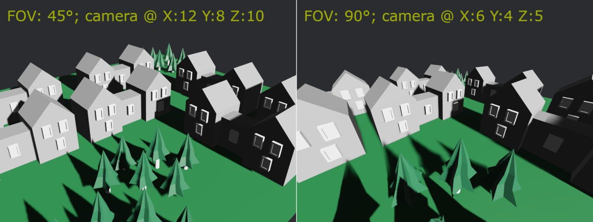
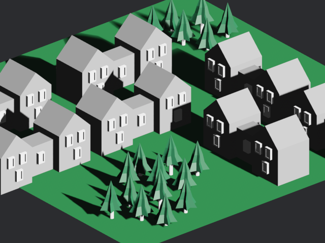
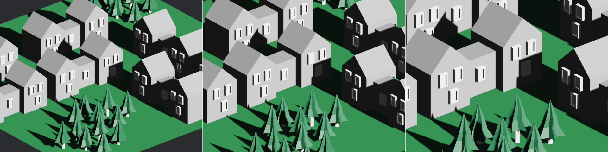

{{#include ../include/header012.md}}

# 3D Camera Setup

[Cameras][cb::camera] in Bevy are mandatory to see anything: they configure the
rendering.

This page will teach you about the specifics of 3D cameras. If you want to learn about
general non-3D specific functionality, see the [general page on cameras][cb::camera].

## Creating a 3D Camera

Bevy provides a [bundle][cb::bundle] that you can use to [spawn][cb::commands] a
camera [entity][cb::entity]. It has reasonable defaults to set up everything
correctly.

You might want to set the [transform][cb::transform], to position the camera.

```rust,no_run,noplayground
{{#include ../code012/src/d3/camera.rs:basic-setup}}
```

The "looking at" function is an easy way to orient a 3D camera. The second
parameter (which we provide as `Y`) is the "up" direction. If you want the camera
to be tilted sideways, you can use something else there. If you want to make a
top-down camera, looking straight down, you need to use something other than `Y`.

## Projection

The [projection][cb::camera-projection] is what determines how coordinates map to the
[viewport][cb::camera-viewport] (commonly, the screen/window).

3D cameras can use either a Perspective or an Orthographic projection.
Perspective is the default, and most common, choice.

When you spawn a 3D camera using Bevy's [bundle][cb::bundle]
([`Camera3dBundle`][bevy::Camera2dBundle]), it adds the
[`Projection`][bevy::Projection] [component][cb::component] to your
[entity][cb::entity], which is an `enum`, allowing either projection kind to be
used.

When you are working with 3D cameras and you want to access the projection, you
should [query][cb::query] for the [`Projection`][bevy::OrthographicProjection]
[component][cb::component] type. You can then match on the enum, to handle each
case appropriately.

```rust,no_run,noplayground
{{#include ../code012/src/d3/camera.rs:query-projection}}
```

Note that this is different from [2D][cb::camera-2d::projection]. If you are
making a library or some other code that should be able to handle both 2D and
3D, you cannot make a single [query][cb::query] to access both 2D and 3D
cameras. You should create separate [systems][cb::system], or at least two
separate queries, to handle each kind of camera. This makes sense, as you will
likely need different logic for 2D vs. 3D anyway.

### Perspective Projections

Perspective creates a realistic sense of 3D space. Things appear smaller the
further away they are from the camera. This is how things appear to the human
eye, and to real-life cameras.

The most important variable here is the FOV (Field-of-View). The FOV determines
the strength of the perspective effect. The FOV is the angle covered by the
height of the screen/image.

A larger FOV is like a wide-angle camera lens. It makes everything appear more
distant, stretched, "zoomed out". You can see more on-screen.

A smaller FOV is like a telephoto camera lens. It makes everything appear closer
and flatter, "zoomed in". You can see less on-screen.

For reference, a good neutral value is 45° (narrower, Bevy default) or 60°
(wider). 90° is very wide. 30° is very narrow.

```rust,no_run,noplayground
{{#include ../code012/src/d3/camera.rs:fov}}
```



In the above image, we are halving/doubling the FOV and doubling/halving
how far away the camera is positioned, to compensate. Note how you can see
pretty much the same 3D content, but the higher FOV looks more stretched
and has a stronger 3D perspective effect.

Internally, Bevy's perspective projection uses an [infinite reversed
Z][nvidia::infinite-reverse-z] configuration. This allows for good numeric
precision for both nearby and far away objects, avoiding visual artifacts.

#### Zooming

To "zoom", change the perspective projection's FOV.

```rust,no_run,noplayground
{{#include ../code012/src/d3/camera.rs:fov-zoom}}
```

If the camera does not move, decreasing the FOV makes everything appear closer
and increasing it makes everything appear more distant:


Contrast this with moving the camera itself (using the
[transform][cb::transform]) closer or further away, while keeping the FOV the
same:


In some applications (such as 3D editors), moving the camera might be preferable,
instead of changing the FOV.

### Orthographic Projections

An Orthographic projection makes everything always look the same size,
regardless of the distance from the camera. It can feel like if 3D was squashed
down into 2D.

Orthographic is useful for applications such as CAD and engineering, where you
want to accurately represent the dimensions of an object. Some games (notably
simulation games) might use orthographic as an artistic choice.

Orthographic can feel confusing and unintuitive to some people, because it does
not create any sense of 3D space. You cannot tell how far away anything is. It
creates a perfectly "flat" look. When displayed from a top-down diagonal angle,
this artistic style is sometimes referred to as "isometric".

You should set the [`ScalingMode`][bevy::ScalingMode] according to how you want
to handle window size / resolution.

```rust,no_run,noplayground
{{#include ../code012/src/d3/camera.rs:ortho}}
```



#### Zooming

To "zoom", change the orthographic projection's scale. The scale determines
how much of the scene is visible.

```rust,no_run,noplayground
{{#include ../code012/src/d3/camera.rs:orthographic-zoom}}
```


