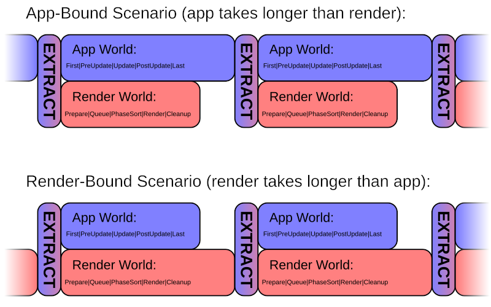

{{#include ../include/header09.md}}

# Render Architecture Overview

**NOTE:** This chapter of the book is an early *Work in Progress*!
Many links are still broken!

---

The current Bevy render architecture premiered in Bevy 0.6. The [news blog
post][bevy::blog::0.6] is another place you can learn about it. :)

It was inspired by the Destiny Render Architecture (from the Destiny game).

## Pipelined Rendering

Bevy's renderer is architected in a way that operates independently from all
the normal app logic. It operates in its own separate [ECS World][cb::world]
and has its own [schedule][cb::app], with [stages][cb::render::stage] and
[systems][cb::system].

The plan is that, in a future Bevy version, the renderer will run in parallel
with all the normal app logic, allowing for greater performance. This is
called "pipelined rendering": rendering the previous frame at the same time
as the app is processing the next frame update.

Every frame, the two parts are synchronized in a special [stage][cb::stage]
called "Extract". The Extract stage has access to both [ECS Worlds][cb::world],
allowing it to copy data from the main World into the render World.

From then on, the renderer only has access to the render World, and can only
use data that is stored there.

Every frame, all [entities][cb::ec] in the render World are erased, but
[resources][cb::res] are kept. If you need to persist data from frame to
frame, store it in resources. Dynamic data that could change every frame
should be copied into the render world in the Extract stage, and typically
stored using entities and components.

## Core Architecture

The renderer operates in multiple [render stages][cb::render::stage]. This
is how the work that needs to be performed on the CPU is managed.

{{#include ../include/builtins.md:render-stages}}

The ordering of the workloads to be performed on the GPU is controlled
using the [render graph][cb::render::graph]. The graph consists of
[nodes][cb::render::graph-node], each representing a workload for the GPU,
typically a [render pass][cb::render::pass]. The nodes are connected using
[edges][cb::render::graph-edge], representing their ordering/dependencies
with regard to one another.

## Layers of Abstraction

The Bevy rendering framework can accomodate you working at various different
levels of abstraction, depending on how much you want to integrate with the
Bevy ecosystem and built-in features, vs. have more direct control over the GPU.

For most things, you would be best served by the "high-level" or "mid-level" APIs.

### Low-Level

Bevy works directly with [`wgpu`][project::wgpu], a Rust-based cross-platform
graphics API. It is the abstraction layer over the GPU APIs of the underlying
[platform][chapter::platforms]. This way, the same GPU code can work on all
supported platforms. The API design of [`wgpu`][project::wgpu] is based on
the WebGPU standard, but with extensions to support native platform features,
going beyond the limitations of the web platform.

{{#include ../include/builtins.md:wgpu-backends}}

`wgpu` forms the "lowest level" of Bevy rendering. If you really need the
most direct control over the GPU, you can pretty much use `wgpu` directly,
from within the Bevy render framework.

### Mid-Level

On top of `wgpu`, Bevy provides some abstractions that can help you, and
integrate better with the rest of Bevy.

The first is [pipeline caching][cb::render::pipelinecache] and
[specialization][cb::render::pipeline-specialized]. If you create your
[render pipelines][cb::render::pipeline] via this interface, Bevy can manage
them efficiently for you, creating them when they are first used, and then
caching and reusing them, for optimal performance.

Caching and specialization are, analogously, also available for [GPU Compute
pipelines][cb::render::compute].

Similar to the [pipeline cache][cb::render::pipelinecache], there is a [texture
cache][cb::render::texturecache]. This is what you use for rendering-internal
[textures][cb::render::texture] (for example: shadow maps, reflection maps,
…), that do not originate from [assets][cb::asset]. It will manage and
reuse the GPU memory allocation, and free it when it becomes unused.

For using data from [assets][cb::asset], Bevy provides the [Render
Asset][cb::render::asset] abstraction to help with extracting the data from
different [asset types][builtins::asset].

Bevy can manage all the "objects to draw" using [phases][cb::render::phase],
which sort and draw [phase items][cb::render::phaseitem]. This way, Bevy
can sort each object to render, relative to everything else in the scene,
for optimal performance and correct transparency (if any).

Phase Items are defined using [render commands][cb::render::rendercommand]
and/or [draw functions][cb::render::drawfunction]. These are, conceputally,
the rendering equivalents of ECS [systems][cb::system] and [exclusive
systems][cb::exclusive], fetching data from the ECS World and generating
[draw calls][cb::render::drawcall] for the GPU.

All of these things fit into the core architecture of the Bevy [render
graph][cb::render::graph] and [render stages][cb::render::stage]. During
the Render stage, [graph nodes][cb::render::graph-node] will execute [render
passes][cb::render::pass] with the [render phases][cb::render::phase],
to draw everything as it was set up in the Prepare/Queue/PhaseSort stages.

The `bevy_core_pipeline` crate defines a set of [standard
phase/item][cb::render::phase-core] and main pass types. If you can, you
should work with them, for best compatibility with the Bevy ecosystem.

### High-Level

On top of all the mid-level APIs, Bevy provides abstractions to make many
common kinds of workloads easier.

The most notable higher-level features are [meshes][cb::render::mesh] and
[materials][cb::render::material].

Meshes are the source of per-vertex data ([vertex
attributes][cb::render::vertexattribute]) to be fed into
your [shaders][cb::render::shader]. The material specifies what
[shaders][cb::render::shader] to use and any other data that needs to be
fed into it, like [textures][cb::render::texture].
