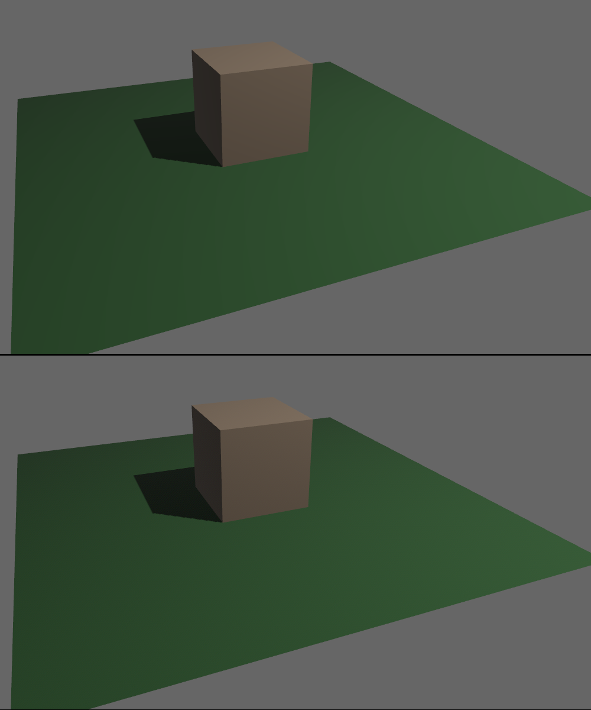

{{#include ../include/header012.md}}

# HDR

HDR (High Dynamic Range) refers to the ability of the game engine to handle
very bright lights or colors. Bevy's rendering is HDR internally. This means
you can have objects with colors that go above `1.0`, very bright lights,
or bright emissive materials. All of this is supported for both 3D and 2D.

This is not to be confused with HDR display output, which is the ability to
produce a HDR image to be displayed by a modern monitor or TV with HDR
capabilities. Bevy has no support for this yet.

The internal HDR image has to be converted down to SDR (Standard Dynamic
Range) before it can be displayed on the screen. This process is called
[Tonemapping][cb::tonemap]. Bevy supports different algorithms that can
result in a different look. It is an artistic choice what tonemapping
algorithm to use for your game.

## Camera HDR configuration

There is a per-camera toggle that lets you decide whether you want Bevy to
preserve the HDR data internally, to make it possible for subsequent passes
(such as postprocessing effects) to use it.

```rust,no_run,noplayground
{{#include ../code012/src/graphics/hdr_tonemap.rs:hdr-config}}
```

If it is enabled, Bevy's intermediate textures will be in HDR format. The
shaders output HDR values and Bevy will store them, so they can be used in later
rendering passes. This allows you to enable effects like [Bloom][cb::bloom],
that make use of the HDR data. [Tonemapping][cb::tonemap] will happen as a
post-processing step, after the HDR data is no longer needed for anything.

If it is disabled, the shaders are expected to output standard RGB colors in
the 0.0 to 1.0 range. [Tonemapping][cb::tonemap] happens in the shader. The
HDR information is not preserved. Effects that require HDR data, like Bloom,
will not work.

It is disabled by default, because this results in better performance and
reduced VRAM usage for applications with simple graphics that do not need it.

If you have both HDR and MSAA enabled, it is possible you might encounter
issues. There might be visual artifacts in some cases. It is also unsupported on
Web/WASM, crashing at runtime. Disable MSAA if you experience any such issues.

## Tonemapping

Tonemapping is the step of the rendering process where the colors of pixels are
converted from their in-engine intermediate repesentation into the final values
as they should be displayed on-screen.

This is very important with HDR applications, as in that case the image can
contain very bright pixels (above 1.0) which need to be remapped into a range
that can be displayed.

Tonemapping is enabled by default. Bevy allows you to configure it via the
([`Tonemapping`][bevy::Tonemapping]) component, per-camera. Disabling it is not
recommended, unless you know you only have very simple graphics that don't need
it. It can make your graphics look incorrect.

```rust,no_run,noplayground
{{#include ../code012/src/graphics/hdr_tonemap.rs:tonemap-config}}
```

Bevy supports many different tonemapping algorithms. Each of them results in a
different look, affecting colors and brightness. It can be an artistic choice. You
can decide what algorithm looks best for your game. Bevy's default is TonyMcMapface,
which, despite the silly name, provides very good results for a wide variety of
graphics styles. See the ([`Tonemapping`][bevy::Tonemapping]) documentation for
an explanation of each of the available choices.

Some tonemapping algorithms (incl. the default TonyMcMapface) require the
`tonemapping_luts` [cargo feature][cb::features]. It is enabled by default. Be
sure to re-enable it if you disable default features and you need it. Enabling
it also enables the `ktx2` and `zstd` features, because it works by embedding
special data in KTX2 format into your game, which is used during tonemapping.

The following tonemapping algorithms *DO NOT* require the special data from
`tonemapping_luts`:
 - Reinhard
 - ReinhardLuminance
 - AcesFitted
 - SomewhatBoringDisplayTransform

The following tonemapping algorithms *require* the special data from `tonemapping_luts`:
 - AgX
 - TonyMcMapface
 - BlenderFilmic

If you want to make a smaller game binary (might be important for Web games),
you could reduce bloat by changing the default tonemapping to something
simpler and disabling the [cargo features][cb::features].

## Color Grading

Color Grading is a manipulation of the overall look of the image.

Together with tonemapping, this affects the "tone"/"mood" of the final image.

This is also how you can implement a "retina" effect, where the camera
dynamically adapts to very dark (such as inside a cave) and very bright
(such as in daylight) scenes, by adjusting exposure/gamma.

You can also adjust color saturation. Heavily desaturating the image can
result in a greyscale or muted appearance, which can be a great artistic
choice for apocalyptic or horror games.

You can configure these parameters via the [`ColorGrading`][bevy::ColorGrading]
component:

```rust,no_run,noplayground
{{#include ../code012/src/graphics/hdr_tonemap.rs:color-grading}}
```

## Deband Dithering

Deband dithering helps color gradients or other areas with subtle changes in
color to appear higher-quality, without a "color banding" effect.

It is enabled by default, and can be disabled per-camera.

```rust,no_run,noplayground
{{#include ../code012/src/graphics/hdr_tonemap.rs:deband-dither}}
```

Here is an example image without dithering (top) and with dithering (bottom).
Pay attention to the quality/smoothness of the green color gradient on the
ground plane. In games with photorealistic graphics, similar situations can
arise in the sky, in dark rooms, or lights glowing with a bloom effect.


